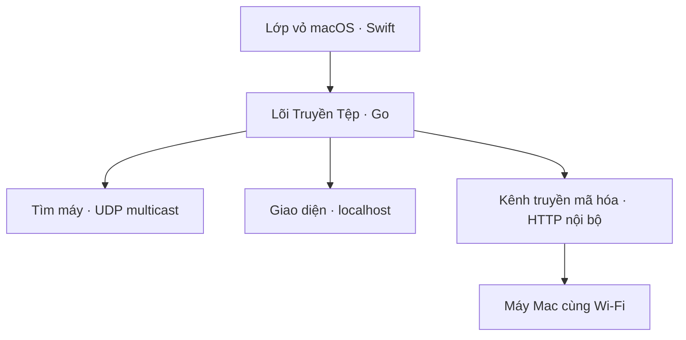

# Truyền Tệp

Ứng dụng macOS tối giản để hai máy cùng mạng nội bộ tự tìm thấy nhau và gửi clipboard hoặc tệp trực tiếp, không qua máy chủ trung gian.

## Điểm chính

- Tự tìm máy bằng UDP multicast, không cần nhập địa chỉ IP trong điều kiện mạng thông thường.
- Mã hóa đầu-cuối từng lần truyền: X25519 tạo bí mật chung, HKDF-SHA-256 sinh khóa phiên, AES-256-GCM mã hóa/xác thực từng khối 64 KiB.
- Tệp được truyền theo luồng, hỗ trợ đến 4 GiB, lưu vào `~/Downloads/Truyền Tệp` bằng tệp tạm rồi đổi tên nguyên tử.
- Chạy trên thanh trạng thái macOS; giao diện điều khiển chỉ mở trên `127.0.0.1`.
- Không cơ sở dữ liệu, không dịch vụ đám mây, không theo dõi người dùng.

## Kiến trúc



HTTP chỉ đóng vai trò vận chuyển trong mạng nội bộ; nội dung bên trong đã được mã hóa và xác thực bằng AES-GCM. Khóa riêng thiết bị nằm tại `~/Library/Application Support/TruyenTep/identity-key`, quyền `0600`. Khóa phiên mới được tạo cho từng clipboard/tệp.

> Phạm vi an toàn hiện tại: chống đọc lén và sửa dữ liệu trên đường truyền. Việc xác thực danh tính dùng vân tay khóa hiển thị theo từng máy; bản này chưa có bước ghép đôi bằng mã để chống kẻ tấn công chủ động trong chính mạng nội bộ.

## Biên dịch

Yêu cầu macOS 12+, Xcode Command Line Tools và Go 1.22+.

```bash
xcode-select --install
brew install go
./scripts/build-macos.sh
```

Kết quả nằm trong `dist/TruyenTep-macOS-v0.2.0.zip`. Kịch bản tạo lõi phổ dụng Intel/Apple Silicon, biên dịch lớp vỏ Swift, tạo biểu tượng `.icns`, ký cục bộ và chỉ đóng gói ứng dụng, không kèm mã nguồn hoặc tài liệu dự án.

## Kiểm thử

```bash
go test ./...
go vet ./...
```

Giấy phép MIT.
