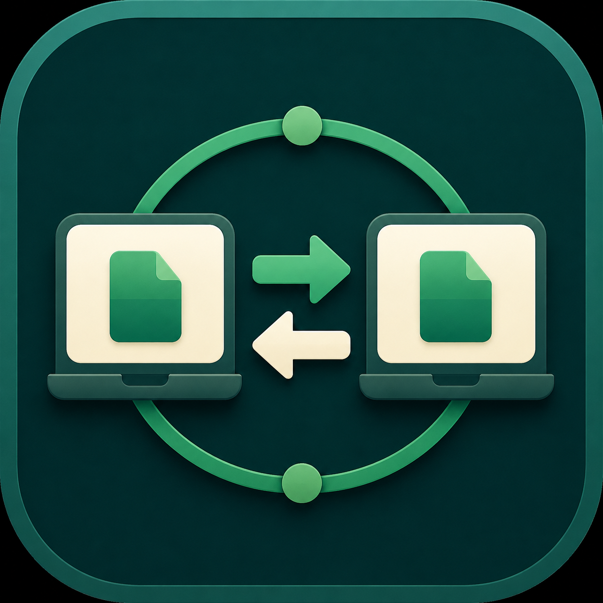
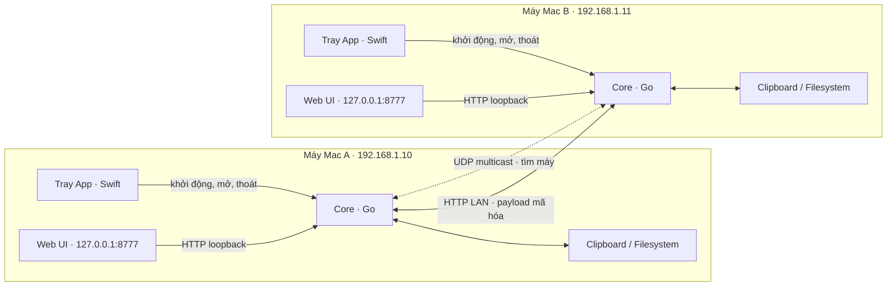
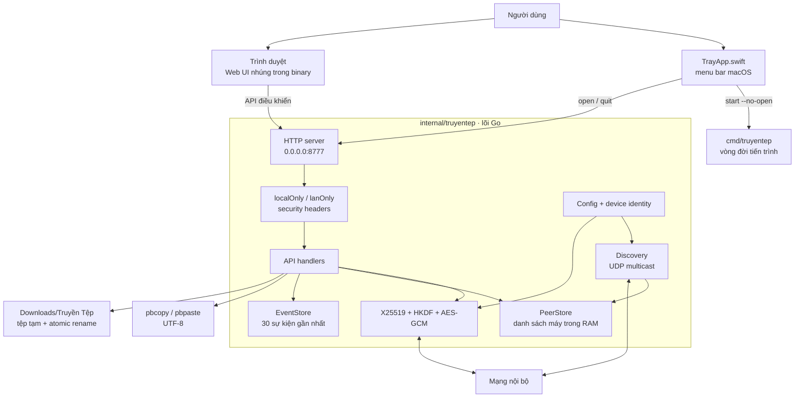
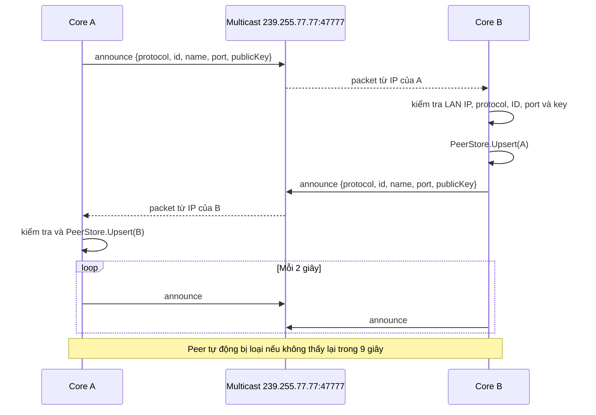
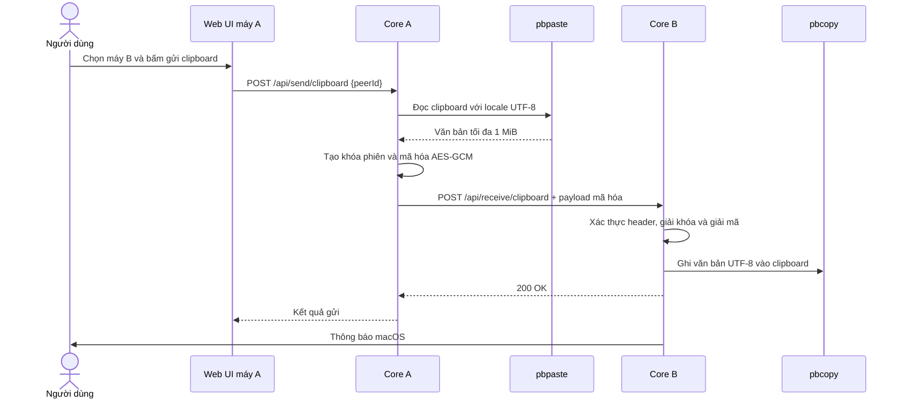
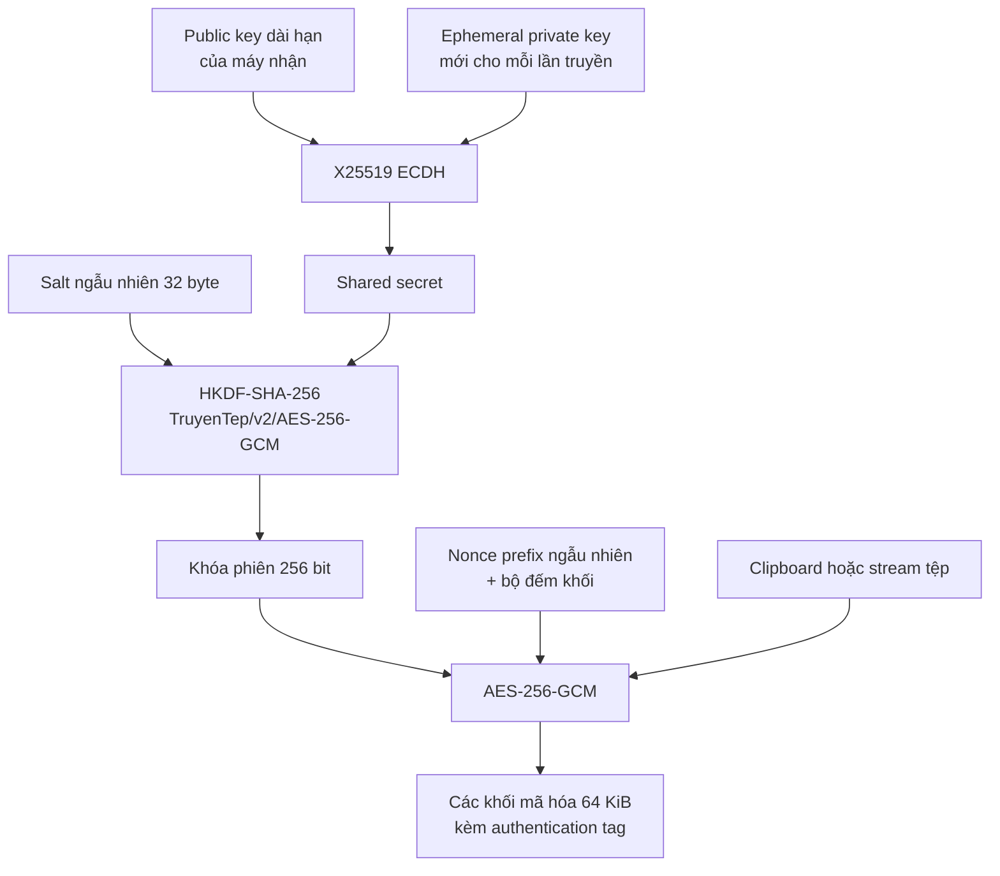
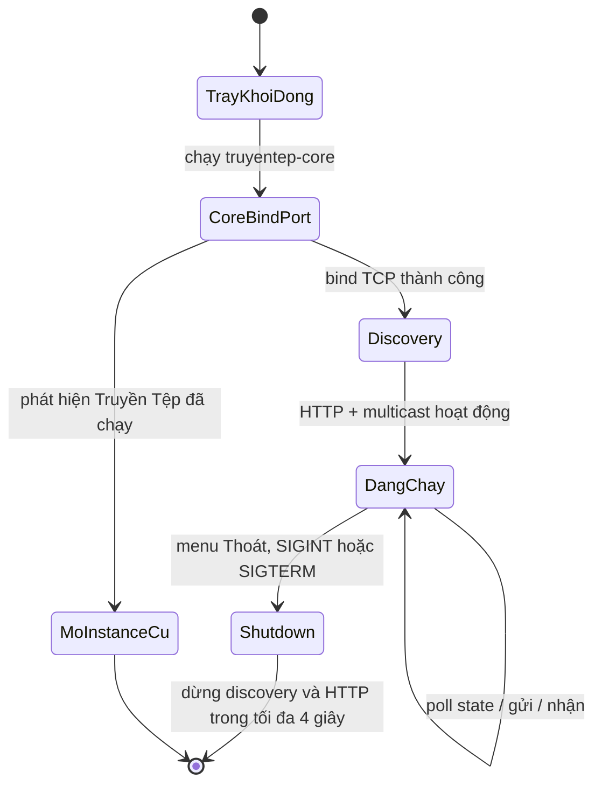

# Truyền Tệp

<p align="center">
  
</p>

<p align="center">
  Ứng dụng macOS tối giản để các máy trong cùng mạng nội bộ tự tìm thấy nhau và gửi clipboard hoặc tệp trực tiếp, không qua máy chủ trung gian.
</p>

## Điểm chính

- Tự tìm máy bằng UDP multicast, không cần nhập địa chỉ IP trong điều kiện mạng thông thường.
- Mã hóa đầu-cuối từng lần truyền: X25519 tạo bí mật chung, HKDF-SHA-256 sinh khóa phiên, AES-256-GCM mã hóa và xác thực từng khối 64 KiB.
- Tệp được truyền theo luồng, hỗ trợ đến 4 GiB và không cần nạp toàn bộ nội dung vào bộ nhớ.
- Tệp nhận được ghi vào tệp tạm rồi đổi tên nguyên tử trong `~/Downloads/Truyền Tệp`.
- Chạy trên thanh trạng thái macOS; giao diện điều khiển chỉ có thể sử dụng từ loopback.
- Không cơ sở dữ liệu, không dịch vụ đám mây và không theo dõi người dùng.

## Kiến trúc tổng thể

Truyền Tệp là ứng dụng peer-to-peer trong mạng LAN. Mỗi máy vừa là máy gửi vừa là máy nhận. `127.0.0.1:8777` chỉ phục vụ giao diện trên chính máy đó; khi truyền dữ liệu, hai lõi Go kết nối với nhau bằng địa chỉ LAN, ví dụ `192.168.1.10:8777` đến `192.168.1.11:8777`.



Hai máy có thể dùng cùng port `8777` mà không xung đột vì mỗi port thuộc một network stack và địa chỉ IP riêng. Xung đột chỉ xảy ra nếu một tiến trình khác trên **cùng một máy** đã chiếm port đó.

## Các thành phần trên mỗi máy



### Lớp vỏ macOS

`macos/TrayApp.swift` tạo ứng dụng menu bar với `LSUIElement=true`, nên app không xuất hiện như một cửa sổ thông thường trong Dock. Lớp vỏ:

- Khởi động binary Go `truyentep-core` với `--no-open`.
- Mở giao diện tại `http://127.0.0.1:8777`.
- Mở thư mục nhận tệp.
- Gửi `POST /api/quit` trước khi dừng tiến trình lõi.

### Lõi Go

`cmd/truyentep` đọc cấu hình dòng lệnh, tạo `App` và quản lý tín hiệu `SIGINT`/`SIGTERM`. Gói `internal/truyentep` chịu trách nhiệm cho HTTP server, discovery, mã hóa, truyền dữ liệu, clipboard, filesystem, thông báo macOS và trạng thái trong bộ nhớ.

HTTP server lắng nghe trên `0.0.0.0:8777` vì cùng một server phải phục vụ hai loại lưu lượng:

- **Loopback:** giao diện và API điều khiển trên chính máy đó.
- **LAN:** ping và API nhận dữ liệu từ máy ngang hàng.

Middleware kiểm tra IP nguồn để tách hai phạm vi. Giao diện tĩnh và các thao tác điều khiển bị từ chối nếu yêu cầu không đến từ loopback; API nhận dữ liệu chỉ chấp nhận loopback, IP private hoặc link-local.

### Web UI

HTML, CSS và JavaScript nằm trong `internal/truyentep/web` và được nhúng vào binary bằng `go:embed`. Giao diện gọi `/api/state` mỗi 2 giây để cập nhật máy trực tuyến, lịch sử truyền và lỗi discovery. Các thao tác thay đổi trạng thái phải gửi header `X-Truyen-Tep-Local: 1` và vẫn phải đến từ loopback.

Không có database: danh sách peer và tối đa 30 sự kiện gần nhất chỉ tồn tại trong RAM, nên được làm mới khi app khởi động lại.

## Cơ chế tìm máy

Mỗi lõi tham gia multicast group `239.255.77.77:47777`, phát thông báo ngay khi khởi động và lặp lại mỗi 2 giây. Thông báo gồm phiên bản protocol, device ID, tên máy, HTTP port và public key. IP của peer không lấy từ payload mà lấy từ địa chỉ nguồn của UDP packet.



Nếu multicast bị chặn bởi router, Wi-Fi isolation hoặc firewall, người dùng có thể thêm peer thủ công bằng `IP` hoặc `IP:port`. Core gọi `/api/ping` để xác minh protocol và lấy public key trước khi lưu peer.

## Luồng gửi clipboard



Nội dung clipboard không đi qua Web UI và không xuất hiện trong `/api/state`. Trình duyệt chỉ yêu cầu lõi đọc clipboard hệ thống rồi gửi đến peer đã chọn.

## Luồng gửi tệp

```mermaid
flowchart LR
  F["Tệp từ trình duyệt"] -->|"stream HTTP"| SA["Core gửi"]
  SA -->|"đọc từng khối 64 KiB"| ENC["AES-256-GCM<br/>mã hóa + xác thực"]
  ENC -->|"HTTP LAN"| DEC["AES-256-GCM<br/>xác thực + giải mã"]
  DEC -->|"io.Pipe"| TMP[".truyen-tep-*.part"]
  TMP --> SYNC["fsync + chmod 0644"]
  SYNC --> NAME["chọn tên không trùng"]
  NAME --> RENAME["atomic rename"]
  RENAME --> DONE["~/Downloads/Truyền Tệp"]
```



Core gửi nối request từ trình duyệt với request LAN bằng `io.Pipe`; core nhận cũng nối bộ giải mã với writer của tệp tạm. Vì vậy bộ nhớ sử dụng không tăng theo kích thước tệp. Tên tệp được loại bỏ path traversal, ký tự điều khiển và giới hạn độ dài. Nếu tên đã tồn tại, app tạo tên dạng `ten (1).ext` thay vì ghi đè.

Nếu truyền, xác thực hoặc ghi đĩa thất bại, tệp `.part` được xóa. Chỉ sau khi toàn bộ stream đã được giải mã, ghi và đồng bộ thành công thì tệp mới được đổi sang tên cuối cùng.

## Mã hóa và định dạng truyền

Mỗi thiết bị có một cặp khóa X25519 dài hạn. Private key nằm tại:

```text
~/Library/Application Support/TruyenTep/identity-key
```

Thư mục có quyền `0700`, tệp khóa có quyền `0600`. Device ID là 16 byte đầu của SHA-256 public key, biểu diễn dạng hex; giao diện hiển thị thêm fingerprint để người dùng đối chiếu.



Mỗi lần truyền tạo ephemeral key, salt và nonce prefix mới. Từng khối có nonce riêng; số thứ tự và kích thước plaintext được đưa vào Additional Authenticated Data. Bất kỳ thay đổi nào đối với ciphertext, tag, thứ tự hoặc kích thước khối đều khiến quá trình xác thực thất bại.

Metadata cần để máy nhận tạo lại khóa phiên được chuyển qua HTTP headers:

| Header | Ý nghĩa |
| --- | --- |
| `X-Truyen-Tep-Protocol` | Phiên bản protocol hiện tại |
| `X-Truyen-Tep-Device` | Device ID máy gửi |
| `X-Truyen-Tep-Name` | Tên máy gửi đã được làm sạch |
| `X-Truyen-Tep-Key` | Ephemeral public key của lần truyền |
| `X-Truyen-Tep-Salt` | Salt cho HKDF |
| `X-Truyen-Tep-Nonce` | Nonce prefix của stream |
| `X-Truyen-Tep-Size` | Kích thước plaintext dự kiến |

HTTP chỉ đóng vai trò vận chuyển trong LAN; clipboard và nội dung tệp bên trong đã được mã hóa và xác thực bằng AES-GCM.

## API và ranh giới truy cập

| Endpoint | Phạm vi | Mục đích |
| --- | --- | --- |
| `GET /`, `/app.js`, `/style.css` | Loopback | Giao diện điều khiển |
| `GET /api/state` | Loopback | Trạng thái, peer và lịch sử gần nhất |
| `POST /api/send/clipboard` | Loopback + local header | Gửi clipboard đến peer |
| `POST /api/send/file` | Loopback + local header | Stream tệp đến peer |
| `POST /api/peers/manual` | Loopback + local header | Thêm peer bằng IP |
| `POST /api/open-downloads` | Loopback + local header | Mở thư mục nhận |
| `POST /api/quit` | Loopback + local header | Dừng lõi ứng dụng |
| `GET /api/ping` | LAN tin cậy | Xác minh peer và trao đổi public key |
| `POST /api/receive/clipboard` | LAN tin cậy + protocol header | Nhận clipboard mã hóa |
| `POST /api/receive/file` | LAN tin cậy + protocol header | Nhận stream tệp mã hóa |

Các response còn đặt CSP, `X-Frame-Options: DENY`, `X-Content-Type-Options: nosniff`, Referrer Policy và Permissions Policy để giảm bề mặt tấn công của Web UI.

## Mô hình bảo mật

Truyền Tệp hiện bảo vệ:

- Nội dung khỏi bị đọc trên đường truyền LAN.
- Nội dung và thứ tự khối khỏi bị sửa mà không bị phát hiện.
- API điều khiển khỏi các máy khác trong LAN.
- Filesystem khỏi path traversal và ghi đè tệp hiện có.
- Private key bằng quyền truy cập filesystem của tài khoản macOS.

Giới hạn hiện tại:

- Public key được quảng bá qua discovery và chưa có bước ghép đôi bằng mã xác nhận.
- Fingerprint phải được người dùng tự đối chiếu nếu mạng LAN không đáng tin cậy.
- Một kẻ tấn công chủ động trong cùng LAN có thể giả mạo discovery trước khi hai bên xác minh fingerprint.
- HTTP metadata không bí mật; chỉ payload clipboard/tệp được mã hóa đầu-cuối.

> Phạm vi an toàn hiện tại là chống đọc lén và sửa payload trên đường truyền. Không nên xem phiên bản này là cơ chế xác thực peer hoàn chỉnh cho mạng LAN thù địch.

## Vòng đời ứng dụng



Nếu port mặc định đã được một instance Truyền Tệp chiếm, tiến trình mới nhận diện `/api/ping` và mở instance hiện có. Nếu port bị một ứng dụng không liên quan chiếm, core dừng với lỗi bind port.

## Cấu trúc mã nguồn

```text
truyentep/
├── cmd/truyentep/             # Entry point và cờ dòng lệnh
├── internal/truyentep/
│   ├── app.go                 # Vòng đời HTTP server và discovery
│   ├── config.go              # Cấu hình, identity và địa chỉ LAN
│   ├── crypto.go              # X25519, HKDF, AES-GCM streaming
│   ├── discovery.go           # UDP multicast và peer discovery
│   ├── files.go               # Lưu tệp an toàn, tên duy nhất
│   ├── handlers.go            # HTTP routes và luồng gửi/nhận
│   ├── network.go             # Phân loại địa chỉ mạng tin cậy
│   ├── platform.go            # Clipboard, notification, open browser/folder
│   ├── types.go               # Config, PeerStore và EventStore
│   └── web/                   # Web UI được nhúng vào binary
├── macos/TrayApp.swift        # Lớp vỏ menu bar macOS
├── packaging/Info.plist       # Bundle metadata và quyền local network
├── assets/                    # Icon nguồn
└── scripts/                   # Build và kiểm tra gói phát hành
```

## Biên dịch

Yêu cầu macOS 12+, Xcode Command Line Tools và Go 1.22+.

Trước khi phát hành, chỉ sửa `version.json`: `version` là phiên bản ứng dụng (ví dụ `0.3.0`), còn `build` phải là JSON integer trong phạm vi `1..9999`. Kịch bản build kiểm tra định dạng hai giá trị trước khi biên dịch, rồi dùng chúng cho version nhúng trong binary và metadata của app bundle.

```bash
xcode-select --install
brew install go
./scripts/build-macos.sh
```

Kết quả nằm trong `dist/TruyenTep-macOS-v<version>.zip`, với `<version>` được đọc từ `version.json`. Kịch bản build:

1. Cross-compile Go core cho `arm64` và `amd64`.
2. Ghép hai binary thành Universal Binary bằng `lipo`.
3. Biên dịch lớp vỏ Swift bằng `swiftc`.
4. Tạo `.icns` từ ảnh nguồn, ghép app bundle và cập nhật version cùng build number.
5. Ký ad-hoc bằng `codesign`.
6. Tạo ZIP chỉ chứa ứng dụng, không kèm mã nguồn hoặc tài liệu dự án.

## Phát hành lên GitHub

Sau khi cập nhật và commit `version.json`, cài đặt GitHub CLI rồi đăng nhập một lần:

```bash
brew install gh
gh auth login
./scripts/publish-release.sh
```

Script đọc version trực tiếp từ `version.json`, chạy test, build file ZIP, tạo annotated tag `v<version>`, push tag lên `origin`, rồi tạo GitHub Release với release notes tự sinh và đính kèm ZIP. Working tree phải sạch và commit hiện tại phải trùng với branch upstream trên `origin`.

Trước khi build hoặc tạo tag, script kiểm tra tag tương ứng trực tiếp trên `origin`. Nếu version trong `version.json` đã tồn tại, quá trình dừng với lỗi và không ghi đè release cũ. Nếu bước tạo GitHub Release thất bại sau khi tag đã được push, tag được giữ nguyên và script in lệnh `gh release create` để thử upload lại an toàn.

## Kiểm thử

```bash
go test ./...
go vet ./...
./scripts/test-version-config.sh
./scripts/test-publish-release.sh
./scripts/test-build-macos-no-source.sh
```

Bộ test bao phủ mã hóa/giải mã và phát hiện sửa dữ liệu, discovery validation, truyền clipboard và tệp end-to-end, giới hạn kích thước, kiểm soát loopback/LAN, xử lý tên tệp và locale UTF-8 của clipboard.

Giấy phép MIT.
